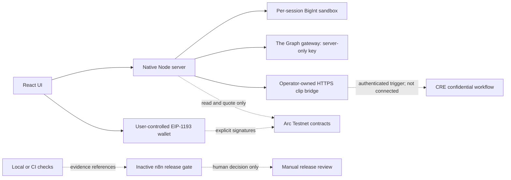

# Implemented architecture

## Execution paths

The standalone HTML replaces HTTP calls with the same pure sandbox model and never claims those calls are live. It is not a background service. The native server serves the built app and separates sandbox state by an opaque, HttpOnly/SameSite cookie.

## Economics and units

Collateral is six-decimal USDC (`10^6`); outcome tokens and shares use 18 decimals (`10^18`). Monetary state transitions use BigInt. Number conversion is limited to displayed ratios and prices.

- Event pair: one YES and one NO, backed by 1 USDC. Winning token pays 1; loser pays zero.
- Asset set (Complete-set conservation): Depositing $C = 500$ USDC collateral mints 1 conditional YES share, 1 conditional NO share, and 1 Residual share ($R$). If YES occurs, YES pays $X = \min(S, C)$, NO pays 0, and $R$ pays $C - X$. If NO occurs, NO pays $X = \min(S, C)$, YES pays 0, and $R$ pays $C - X$. Total payout $X + 0 + (C - X) \equiv C$ in every state of the world, guaranteeing 100% vault solvency.
- Event pool: complete-set mint plus a constant-product outcome swap. The fee is accounted separately.
- Asset pools: one USDC/share constant-product pool per outcome. The full cash input, including fee, stays in that pool.
- Split rounds collateral cost upward. Merge/redemption requires returning equal quantities of all complete-set tokens ($Y + N + R \to C$). Residual and rounding dust never become a hidden refund.
- All initial liquidity is explicitly illustrative. No historical candles or live transaction volume are invented.

`P = reserveNO / (reserveYES + reserveNO)`

`conditionalYES = YES-share midprice / P`

`conditionalNO = NO-share midprice / (1 - P)`

`impact = conditionalYES - conditionalNO`

`impliedIndex = YES-share midprice + NO-share midprice`

Conditional YES is hidden below 2% YES probability; conditional NO is hidden above 98%. With a cap, these prices represent a **capped synthetic payoff**, not an unrestricted stock-price expectation. An uncapped spot reference can legitimately differ.

## State and replay boundaries

Quotes include book, side, decimal cash input, minimum output, revision and a two-minute expiry. Sandbox execution recomputes output and checks revision, expiry, slippage and balance before mutation. Quotes are not signed production trading commitments: each session owns only fictitious funds.

On Arc, the app reads reserves at one block tag, quotes deployed methods, and gives the wallet a bounded minimum output and deadline. The user signs. The server never holds a signing key. A confirmed approval can remain after a later trade fails; this is disclosed rather than called an atomic on-chain bundle.

The owner demo oracle is deliberately trusted. No independent event verification, timelock, dispute system or decentralized settlement is claimed. Production settlement needs a separate design/security review.

## Data availability and trust

The Graph adapter uses a hardcoded gateway host and query variables, requires valid numeric data and a recent block timestamp, and returns unavailable on missing configuration/schema/errors. The included GraphQL projections are schema templates: their compatibility with the user's supplied deployment is unverified. ETH/WETH analogs are not sNVDA identity matches.

The CRE adapter sends a requested size to an operator-approved HTTPS bridge. That bridge is responsible for authenticated CRE invocation and returning the two-field result. The web server/bridge may see requested size; this is not end-to-end private client transport. The secret policy belongs in CRE secret storage. A returned clipped size can reveal the threshold.

## Deliberate scope boundaries

No database, custody service, matching engine, orderbook, stock delivery, public production deployment, live oracle feed, or final human video submission is claimed. Smart contracts and CRE source are fully compiled, verified in Foundry and Node test suites, and exercised through connected browser flows in CI. Public-chain broadcasts, live gateway data, and public hosting remain explicit external gates requiring owner authorization.
