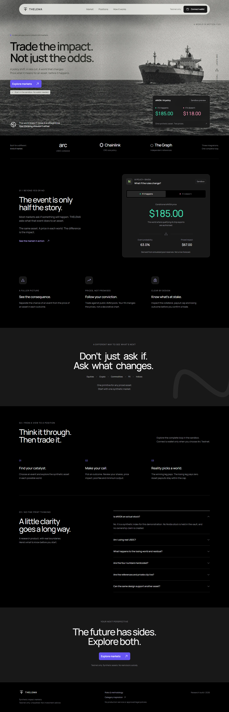
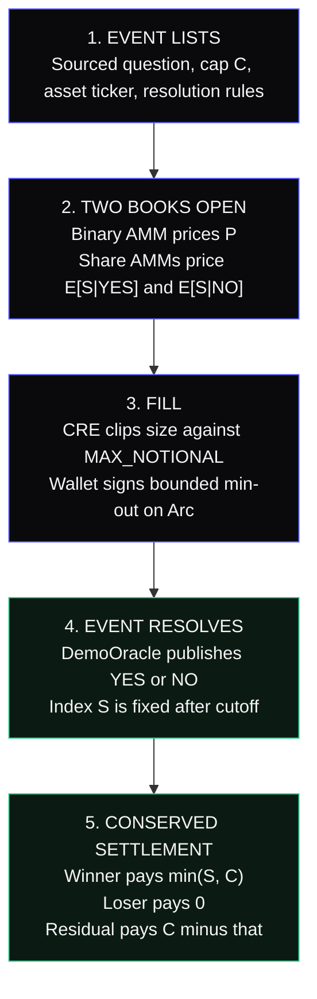
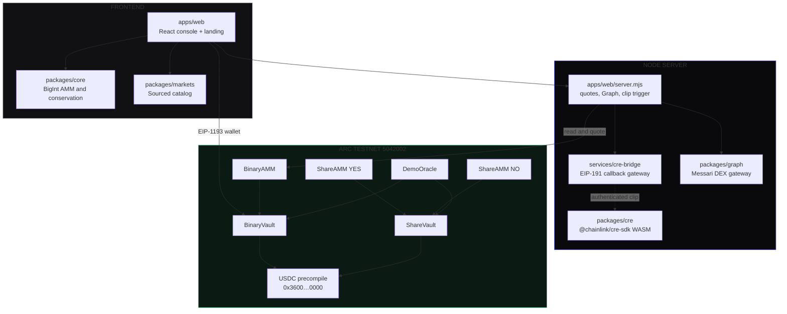

# THELEMA

**Trade the impact. Not just the odds.**

THELEMA is an impact-market protocol on Arc. It prices what an event does to an asset — a chip export rule, a rate decision, a statute — not only whether the event happens. Binary probability and conditional asset payoffs live in the same conserved USDC vault.

Live Web Application: [https://thelema.onrender.com](https://thelema.onrender.com)  
Target Network: **Arc Testnet** (Chain ID `5042002`)



---

## What is THELEMA?

THELEMA is an on-chain market where **one event produces two world prices for the same asset**, and **settlement is a conserved payout**, not a discretionary oracle print.

Prediction markets force a choice between two incomplete products:

1. **Yes/No books**, which tell you if something happens and stop there.
2. **Cash oracles and CFDs**, which guess the move after the fact and require a trusted feed.

THELEMA lists both books against the same collateral: a binary pool for \(P(\text{event})\), and an impact pool for \(\mathbb{E}[S \mid \text{YES}]\) and \(\mathbb{E}[S \mid \text{NO}]\).

---

## Why THELEMA?

| Feature | Standard prediction markets | THELEMA |
| :--- | :--- | :--- |
| **Payoff** | $1 if the event happens, $0 if not. | **Impact shares** pay \(\min(S, C)\) in the winning world. Residual holds the rest of the cap. |
| **What you trade** | Probability of a headline. | **Two world prices** for the same index — If happens / If not. |
| **Collateral** | Mixed stables, wrapped synthetics, or off-chain cash. | **Arc native USDC** precompile `0x3600…0000`. Complete-set conservation \(C \to Y + N + R\). |
| **Liquidity** | Order books or ad-hoc AMM. | **Constant-product AMMs** for the binary pair and each world share. |
| **Size policy** | Public notional; large fills leak on-chain immediately. | **Chainlink CRE clip** against a private `MAX_NOTIONAL` before the fill is signed. |
| **Market context** | Homegrown price widgets. | **The Graph** Messari DEX schema across Uniswap V3 and SushiSwap. Fails closed if stale. |
| **Honesty** | Inflated volume, placeholder books, “live” oracles that aren’t. | Seed liquidity labeled. Session volume starts at zero. No invented trader counts. |

---

## Product

- **Impact books**: Trade If happens / If not on a sourced event. World prices come from pool reserves, not a CMS.
- **Prediction books**: Standard YES/NO against $1, so \(P\) is the binary mid.
- **Complete-set vaults**: Deposit \(C\) USDC, mint 1 YES + 1 NO + 1 residual. Merge them back to redeem \(C\).
- **Confidential size clipping**: Orders above a private threshold are clipped inside a CRE workflow before they hit the AMM.
- **Cross-protocol tape**: Live Uniswap V3 vs SushiSwap WETH comparison as external context — never used as the settlement oracle.
- **Sandbox console**: Same economics engine in-browser, with Arc wallet path when RPC is configured.

---

## How It Works



THELEMA is **not a broker and not a stock wrapper**. sNVDA, sGOLD, and other tickers are synthetic impact indices. They are not NVIDIA equity, gold custody, or an investment product. Losing shares pay zero.

---

## Architecture



---

## Arc Contracts

Submission market (`deployments/submission-market.json`), **Arc Testnet**:

| Contract | Address | Purpose | Status |
| :--- | :--- | :--- | :--- |
| `DemoOracle` | [`0x648d135701667547e674b087f8b2c28adc053ee1`](https://testnet.arcscan.app/address/0x648d135701667547e674b087f8b2c28adc053ee1) | Event YES/NO and index fix | **TESTNET LIVE** |
| `BinaryVault` | [`0x787c65cfcff30ea1e04a63ffab57ef42b0120ab7`](https://testnet.arcscan.app/address/0x787c65cfcff30ea1e04a63ffab57ef42b0120ab7) | $1 YES/NO complete sets | **TESTNET LIVE** |
| `ShareVault` | [`0x07e657d074e3b2e5a575b3bc30faf4c65f85edea`](https://testnet.arcscan.app/address/0x07e657d074e3b2e5a575b3bc30faf4c65f85edea) | Cap-\(C\) YES/NO/R sets | **TESTNET LIVE** |
| `BinaryAMM` | [`0x84fd754f3c10af24d5d4e38be1853f0cd14525a1`](https://testnet.arcscan.app/address/0x84fd754f3c10af24d5d4e38be1853f0cd14525a1) | Constant-product event pool | **TESTNET LIVE** |
| `ShareAMM` YES | [`0xa6b29a7971dd8773dda804b98c1b348efd7ddf8a`](https://testnet.arcscan.app/address/0xa6b29a7971dd8773dda804b98c1b348efd7ddf8a) | YES-world asset pool | **TESTNET LIVE** |
| `ShareAMM` NO | [`0xdeb8cda6be867bf903b74575c9b81d405a3a2ab5`](https://testnet.arcscan.app/address/0xdeb8cda6be867bf903b74575c9b81d405a3a2ab5) | NO-world asset pool | **TESTNET LIVE** |
| USDC | [`0x3600000000000000000000000000000000000000`](https://testnet.arcscan.app/address/0x3600000000000000000000000000000000000000) | Arc native USDC precompile | **PRECOMPILE** |

Event deadline **31 Dec 2026 23:59:59 UTC**. Trading cutoff **01 Jan 2027 00:59:59 UTC**. Cap **$500**.

Recorded demonstration fill: 1.00 USDC → 1.9036 tYES. Tx [`0xe4208cc8…90a6`](https://testnet.arcscan.app/tx/0xe4208cc844dbfec21d18e38c20630388c2a7c7083bb17583fbe6dfc5a55190a6) (block 61728406). Probability moved 50.0% → 54.7%.

---

## Conservation

Collateral is 6-decimal USDC. Outcome tokens and shares are 18 decimals.

Complete set:

\[
C \;\longrightarrow\; 1\,\text{YES} + 1\,\text{NO} + 1\,R
\]

On the winning world, with index \(S \ge 0\) and cap \(C\):

\[
X = \min(S, C),\qquad \text{loser} = 0,\qquad R = C - X
\]

\[
X + 0 + (C - X) \equiv C
\]

Prices from reserves:

\[
P = \frac{\text{reserveNO}}{\text{reserveYES} + \text{reserveNO}}
\]

\[
\mathbb{E}[S \mid \text{YES}] = \frac{\text{YES share mid}}{P}
\qquad
\mathbb{E}[S \mid \text{NO}] = \frac{\text{NO share mid}}{1-P}
\]

Impact is the gap between those two worlds. YES conditionals hide below 2% probability; NO conditionals hide above 98%.

---

## Confidential Size Clipping

Large notionals are evaluated against a private `MAX_NOTIONAL` inside a Chainlink CRE workflow (`packages/cre`, `@chainlink/cre-sdk` WASM). The HTTP bridge (`services/cre-bridge`) authenticates callbacks with an ephemeral EIP-191 signer, single-use replay tokens, and a canonical JSON SHA-256 digest.

The official CRE CLI simulator was run against the compiled WASM (`docs/cre-sim.txt`). Size-clipping arithmetic verified. The run halted at the staging callback DNS boundary (`bridge.example.com`). There is no production TEE enclave in this repo. Organization deploy access is pending.

---

## Cross-Protocol Intelligence

`packages/graph` queries two independent DEX subgraphs on Arbitrum One through The Graph gateway, using the Messari DEX AMM schema (`liquidityPool`):

| Protocol | Subgraph ID |
| :--- | :--- |
| Uniswap V3 | `FQ6JYszEKApsBpAmiHesRsd9Ygc6mzmpNRANeVQFYoVX` |
| SushiSwap | `9tSS5FaePZnjmnXnSKCCqKVLAqA6eGg6jA2oRojsXUbP` |

Health states: `agreeing`, `disagreeing`, `single_source`, `unavailable`. Block age \(\le 900\)s or the adapter fails closed. This tape is WETH context. It does not price sNVDA and it is not the settlement oracle.

---

## ETHOnline 2026

| Track | What shipped |
| :--- | :--- |
| **Arc — Best DeFi Stablecoin-Native Pool** | Native USDC vaults and AMMs on Arc Testnet. Live deployment and a recorded fill. |
| **Chainlink — Best Confidential Workflow** | CRE size-clip WASM, authenticated bridge, simulator evidence. |
| **The Graph — Standardized Cross-Protocol** | Dual Messari DEX query, consensus/disagreement, fail-closed freshness. |

Contracts and circuits are **unaudited research code**. Not a production financial service.

---

## Getting Started

### Prerequisites

- Node.js >= 22

### Preview (no install)

Open `THELEMA-preview.html` in a browser. In-memory sandbox: trades, clip, split/merge, settle, claim. No RPC.

### Run the app

```bash
git clone https://github.com/ShrikarT/thelema.git
cd thelema
npm ci
npm start
```

Open `http://127.0.0.1:3000`.

### Verify

```bash
npm run build
npm run typecheck
npm test                 # core, catalog, Graph, CRE unit tests
npm run test:contracts   # Foundry invariants
npm run test:bridge
npm run test:bridge:crypto
npm run test:ui
npm run verify:cre
npm run verify:graph
```

---

## Documentation

- [**Architecture**](ARCHITECTURE.md) — execution paths, trust boundaries, quote lifecycle.
- [**Contracts**](docs/CONTRACTS.md) — vaults, AMMs, oracle, precompile bindings.
- [**Integrations**](docs/INTEGRATIONS.md) — Arc, Chainlink CRE, The Graph.
- [**Market sources**](docs/MARKET-SOURCES.md) — questions, tickers, resolution rules, citations.
- [**Evidence**](docs/EVIDENCE.md) — on-chain receipts, simulator logs, UI captures.
- [**Runbook**](docs/RUNBOOK.md) — deploy, seed, operator demo.
- [**Security**](docs/SECURITY.md) — threat notes and explicit non-goals.
- [**Design**](docs/DESIGN.md) — console visual system.
- [**AI attribution**](AI.md) — hackathon disclosure.

---

## Boundaries

- Unaudited. Do not use with real funds.
- Graph context is WETH on Arbitrum, not the impact index.
- CRE is a simulated confidential workflow, not a live TEE.
- Historical demo in `deployments/demo-manifest.json` is closed (cutoff 10 Sep 2026). The submission market above remains the live book.

---

*THELEMA is open-source market infrastructure built for Arc.*
